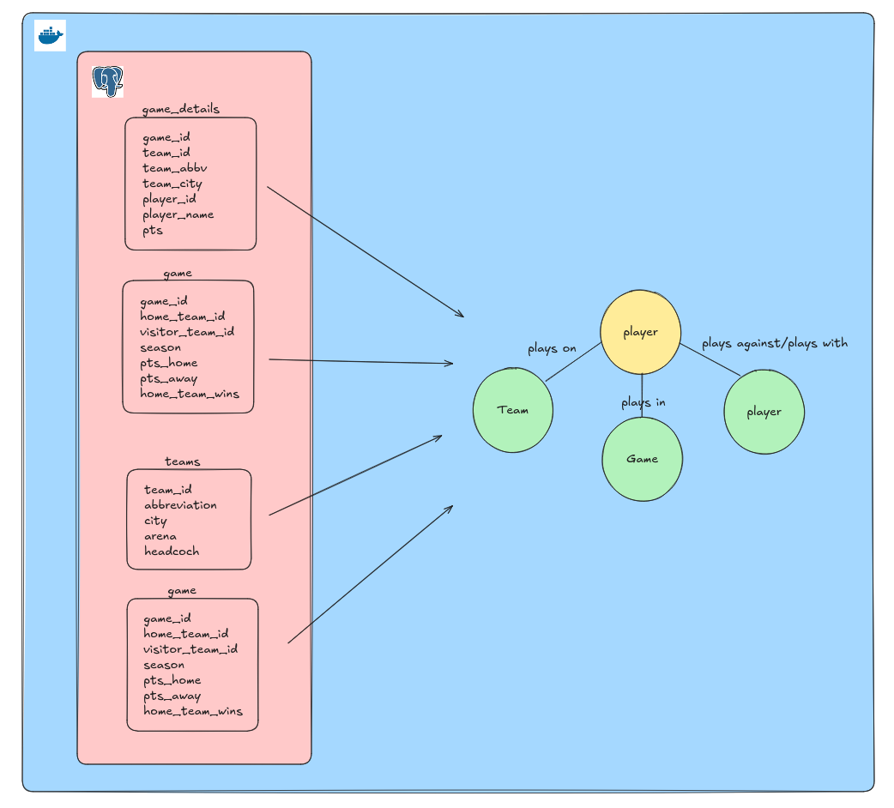

# Graphy
Graph-Data-Modelling


### 🐳 **Run Postgres and PGAdmin in Docker**

- Install Docker Desktop from **[here](https://www.docker.com/products/docker-desktop/)**.
- Copy **`example.env`** to **`.env`**:
    
    ```bash
    cp example.env .env
    ```

- Start the Docker Compose container:
    - If you're on Mac:
        
        ```bash
        make up
        ```
        
    - If you're on Windows:
        
        ```bash
        docker compose up -d
        ```
        
- A folder named **`postgres-data`** will be created in the root of the repo. The data backing your Postgres instance will be saved here.
- You can check that your Docker Compose stack is running by either:
    - Going into Docker Desktop: you should see an entry there with a drop-down for each of the containers running in your Docker Compose stack.
    - Running **`docker ps -a`** and looking for the containers with the name **`postgres`**.
- If you navigate to **`http://localhost:5050`** you will be able to see the PGAdmin instance up and running and should be able to connect to the following server:
    
Where:
    - Host name: host.docker.internal (Or container name i.e my-postgres-container)
    - Port: 5432
    - Username: postgres
    - Password: postgres


- When you're finished with your Postgres instance, you can stop the Docker Compose containers with:
    
    ```bash
    make down
    ```
    
    Or if you're on Windows:
    
    ```bash
    docker compose down -v
    ```



